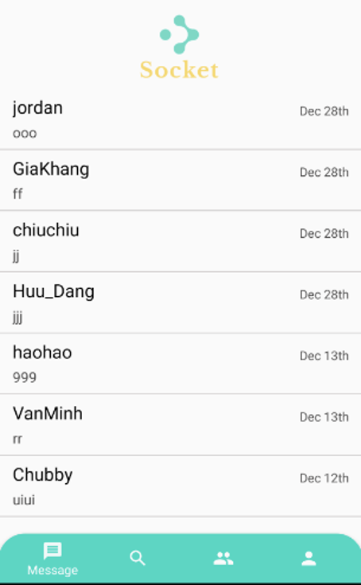

# ⚡️ ⚡️ ⚡️ Introduction
Server side processes requests and real-time services (users send message, users are typing, ...)

[👉🏻 Client side](https://github.com/GiaKhangLuu/android-appchat)

## ⚙️ Technologies used ##

**DBMS:** MongoDB

**Framework:** ExpressJS

**Libraries:** SocketIO (for real-time service), ...

# 📱 App screenshots

<table border="0">
 <tr>
     <td>
        <h3 align="center">Welcome screen</h3>
        </img>
     </td>
     <td>
        <h3 align="center">Login screen</h3>
        </img>
     </td>
 </tr>
 <tr>
    <td>
        <h3 align="center">Message screen</h3>
        </img>
    </td>
    <td>
        <h3 align="center">Chat screen</h3>
        </img>
    </td>
 </tr>
 <tr>
    <td>
        <h3 align="center">Typing notification</h3>
        </img>
    </td>
    <td>
        <h3 align="center">Notification</h3>
        </img>
    </td>
 </tr>
 <tr>
    <td>
        <h3 align="center">Group screen</h3>
        </img>
    </td>
    <td>
        <h3 align="center">Create group</h3>
        </img>
    </td>
 </tr>
</table>
